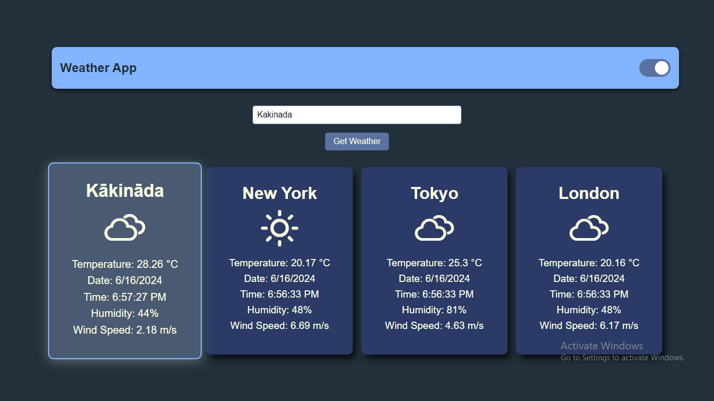

# Weather Application

A weather application that allows users to view current weather information for multiple cities. The application features a dark mode toggle and can fetch weather data for user-entered locations.

## Features

- Display weather information for default cities (New York, Tokyo, London).
- Fetch and display weather data for user-entered locations.
- Dark mode toggle for better viewing experience in low light conditions.
- Responsive design for optimal viewing on various devices (desktop, tablet, mobile).
- Professional level styling for weather cards with highlight effect for the most recently searched location.

## Technologies Used

- HTML
- CSS
- JavaScript
- React
- Axios (for API requests)
- OpenWeatherMap API

## Setup and Installation

### Prerequisites

- Node.js and npm installed on your machine.
- An API key from OpenWeatherMap.

### Installation Steps

1. Clone the repository:
    ```bash
    git clone https://github.com/your-username/weather-app.git
    cd weather-app
    ```

2. Install the dependencies:
    ```bash
    npm install
    ```

3. Start the development server:
    ```bash
    npm start
    ```

4. Open your browser and navigate to `http://localhost:3000` to view the application.

## Usage

- The application will display weather information for the default cities upon loading.
- To fetch weather data for a different location, enter the city name or zip code in the input field and click the "Get Weather" button.
- Use the toggle switch in the header to switch between light mode and dark mode.
- The most recently searched location will be highlighted among the weather cards.


## Screenshots

### Light Mode

### Dark Mode


## Known Issues

- The application does not handle invalid city names gracefully. Improvements can be made to provide better user feedback.

## Future Enhancements

- Implement error handling for invalid input and display user-friendly messages.
- Add more weather details such as forecasts, sunrise and sunset times, etc.
- Improve performance by optimizing API calls and component rendering.

## Contributing

Contributions are welcome! Please open an issue or submit a pull request for any improvements or bug fixes.

